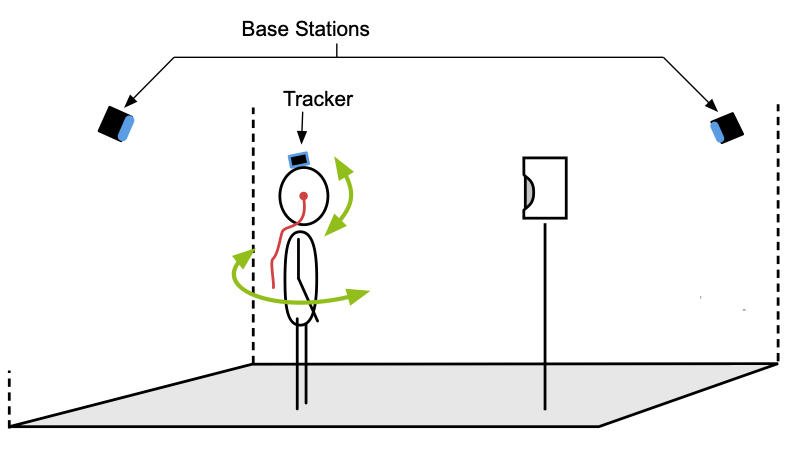
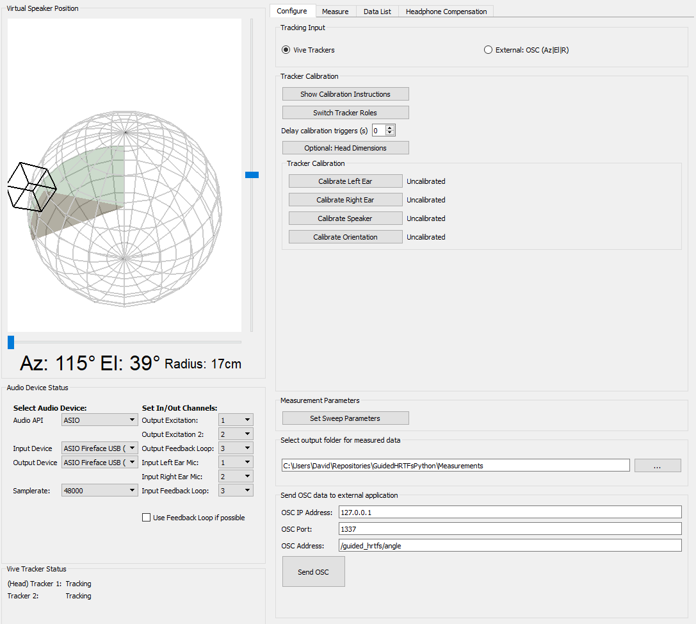

# GuidedHRTFsPython
> __Current State Of Work__ (March 2021) 
>  
> - The project is still in a test phase. It works and provides good results, but needs further evaluation.
> - The postprocessing and upsampling of the Head-Related Impulse Responses (HRIRs) is not part of the repository. Although this is a essential part of the entire project, the current scope of this application is the measurement procedure itself.    
> - We are still looking for a better project name...

## Overview



This project is a GUI-application for fast and easy Head-Related Transfer Function (HRTF) measurements. The measurement system can be used in almost any room, whether reverberant or anechoic. The system has low equipment requirements and is very flexible. It can be used with any loudspeaker, in-ear-microphones, audio interface, and commercially avaiblable tracking system. The user can control the resolution and accuracy of the resulting spatial sampling grid with the number of measurements, and also has the ability to more accurately resolve and prioritize individual directions of interest. Thus, the user is free to perform full-spherical measurements, horizontal measurements, or measurements only covering desired areas.

The measurement procedure is as follows:  

1. Place a loudspeaker in the room, put in-ear microphones on, wire everything up
2. Put a VIVE Tracker on the head and start SteamVR  
3. Run the application and perform a quick calibration routine with a second VIVE Tracker
4. (Beneficial: Perform a center Impulse Response (IR) measurement with a reference microphone)  
5. Perform as many Head-Related Impulse Response (HRIR) measurements as you like by simply moving your head to the disired direction  
6. After that, the system can suggest additional measurement positions to improve the spherical coverage of the dataset  
7. (Beneficial: With the microphones still in the ears, perform headphone measurements for one or more headphones to obtain individual headphone transfer functions and compensation filters)  

> Currently, the system does not apply any post-processing or spatial upsampling to the measured HRIRs. This is done with an external Matlab script.

At least on the first run, the procedure may not work as smoothly as advertised above. We recommend that you read the following notes for further clarification.

 <br>
 <br>
 
## Additional Hardware
### Measurement Equipment
Needless to say, a pair of in-ear microphones is required. We used [these DIY microphones](https://www.researchgate.net/publication/331988584_The_PIRATE_an_anthropometric_earPlug_with_exchangeable_microphones_for_Individual_Reliable_Acquisition_of_Transfer_functions_at_the_Ear_canal_entrance), but any available in-ear microphones should work.

A good measurement loudspeaker with a sufficiently good magnitude and phase response should be available. In the best case, the loudspeaker should be rather small to approximate a point source.
> The low frequency response of the loudspeaker is not that important, as we replace the low-frequency components of the HRTF below 200Hz by an appropriate low-frequency extension [[1](#references)].

Furthermore, an audio interface for capturing the IRs is required. It should at least have two in and outputs. A third input/output is very helpful to have a feedback loop (directly connecting Out3 -> In3) so that the software can compensate any software or DA/AD-latency. Digitally controlled preamps provide a huge benefit for L/R level matching.
### Tracking System
The application is customized for the use of the HTC VIVE system. This tracking system is widely available, easy to use, moderately priced, and offers very accurate and fast tracking capabilites. Unlike many other VR/AR applications, neither the headset nor the contollers are needed, only two additionally available [Trackers](https://www.vive.com/de/accessory/vive-tracker/). 

The application handles the Trackers (SteamVR is needed nevertheless). After performing a simple calibration routine, very accurate relative angles between head and loudspeaker can be measured. 

The application can also receive external tracking data via Open Sound Control (OSC), e.g., if another tracking system is used. In thic case, however, the external system must provide the relative angles between the user's head and the loudspeaker, as the OSC input only evaluates the values *Azimuth*, *Elevation* and *Radius*.

 <br>
 <br>
 
## Install Notes:
The application is coded in Python, so to run it you need Python with a set of external packages. We highly recommend using [conda](https://docs.conda.io/en/latest/) for this.

1. Install conda (Miniconda is sufficient) and download/clone this repository
2. Open your terminal window (or anaconda prompt) and navigate to the repository folder (where the `environment.yml` and `main.py` files are located). To create a new Python environment with all necessary dependencies run  
    ```sh
    conda env create -f environment.yml
    ```
3. Activate the new environment with    
    ```
    conda activate Guided_HRTFs_env  
    ```  
    (To use another environment name, edit the first line of the `environment.yml` file before creating.)
4. To start the application run  
    ```
    python main.py
    ```
    
    
> Note for macOS: The openvr dependency in `environment.yml` is set to an older version to comply with the no longer maintained SteamVR for macOS ('macos_default beta'). For Windows, the most recent version of openvr can be used (edit the `environment.yml` file accordingly). 
 
 <br>
 <br>
 
## Quick Start

### Before starting the application

- SteamVR needs to be running in the background with both trackers connected. 

  


### Configuration


#### Configure Audio Hardware
- In the _Audio Device Status_ panel, you can select your audio input and output device, the samplerate and a custom channel assignment. This comes handy in case you want the input channels 1&2 for the measurements, but maybe input/output channel 7 for the feedback loop.
- Channel Assignment:
    - __Output Excitation__: During the measurements of HRIRs and the reference measurement, this is the channel where the measurement speaker is connected. During the measurement of the HPFC, this is for the headphone´s left channel.
    - __Output Excitation 2__: This channel is only used during the HPCF measurement, where it is for the headphone´s right channel.
    - __Output Feedback Loop__: This channel has to be directly connected to the __Input Feedback Loop__ channel. The excitation signal is played back on this channel, effectively recording a "dry" measurement which can be used for compensating the latency from the audio software. Depending on your audio hardware, you can use a digital audio channel (e.g. ADAT or AES/EBU) for more precision.
    - __Input Left Ear Mic__: Channel for the left in-ear microphone. During the reference measurement, connect the measurement microphone to this channel.
    - __Input Right Ear Mic__: Channel for the right in-ear microphone.
    - __Input Feedback Loop__: See Output Feedback Loop.
- Do not change the audio settings during a single measurement! If needed, you can change the channel configurations for HRIR, reference and HPCF measurements, but do not change the samplerate once you started.

#### A) Calibration using Vive Trackers


1. __Check Trackers:__ First, make sure the trackers are working correctly. When you move the trackers around, the virtual speaker position display should show the relative angle between the trackers. One tracker is the base tracker (for the head tracking) the other one represents the relative loudspeaker position. The relative loudspeakers orientation is not regarded. 
   Accordingly, you can identify the tracker roles by rotating them. If the roles are reversed and you already attached the wrong tracker to the head, you can simply switch the roles by pressing the `Switch Tracker Roles` button.
2. __Calibrate Listener Head:__ With the base tracker attached to the head, hold the second tracker to each ear (the bottom center of the tracker to the ear canal) and press the corresponding calibration button (`Calibrate Left / Right Ear`) in the GUI. This defines the approximated rotation center of the head between the ears.
3. __Calibrate Speaker Position:__ Hold the tracker to the acoustical center of the speaker and press the `Calibrate Speaker` button in the GUI.
4. __Calibrate Listener Orientation:__ Place the tracker on the floor somewhere between the speaker and the desired measurement position, pointing towards the desired view direction (LED on the tracker facing in opposite direction). Point your head exactly into the desired listening direction (look directly to the loudspeaker) and press the `Calibrate Orientation` button in the GUI. Be as accurate as possible during this step and make sure that the tracker is flat on the ground. 

The calibration steps can be repeated in any order, if necesary. After successfull calibration, the second tracker can be switched off.

#### B) Calibration using external tracking system (OSC)
In case you are using another tracking system wich can communicate via OSC, you do not have to performa a calibration. The external tracking system has to take care of the calibration. The external system should supply __relative__ angles (azimuth, elevation, and radius) between the loudspeaker and the user's head, and __not__ the head orientation of the user. The bottom left panel _Vive Tracker Status_ becomes _OSC Input Status_ and will blink if OSC messages are received. 

### Performing Measurements


> Before starting a measurement session, you should give the session a name so that the exported file can be identified later on. For every new session, the session name __must__ be changed, otherwise the previos session will be overwritten.

1. Perform a center measurement with a reference microphone. Place the microphone where the head center will be during the measurements and connect the microphone to the left input (Ch1) of your audio interface. 
2. Place the in-ear microphones in the ear canals and connect them to the left / right input of your audio interface (Ch1/Ch2). Set adequate levels for the output and input of the audio interface (see [notes on measurement setup](resources/doc/measurement-setup-notes.md) for help)
3. Run some measurements. It is best to activate the _Auto Measurement Mode_, where a measurement is triggered when the head is still for 2 seconds. During the measurement, keep your head still for the entire time (even after the sweep is finished) until you hear the sound for a successfull measurement. 
   > A good starting point is to perform around 30 measurements for a full spherical coverage. This should take around 5 minutes.
   
   You can pause the automatic measurement at any time to have a look at the measurements already done in the `Data List` tab. There, you can also delete erroneous measurements. The source positions of the measurements will also be shown in the virtual speaker position display.
3. After your inital measurements, you can ask the _Point Recommender_ for additional points. The recommended point will show up in the virtual speaker position display. By pressing `Start Guidance`, a spoken word guidance will tell you where to move your head (always assuming you are initally looking towards the speaker), followed by a guiding tone interval indicating how close you are to the desired view direction. It is a two step procedure, first guiding your head orientation on the horizontal plance, and then guiding your head orientation to the exact spot by tilting down, up, left, or right.  


### Performing Headphone Measurements

A headphone compensation filter (HPCF) is required for accurate binaural reproduction using the acquired HRTFs. Measuring the individual HPCF directly after the individual HRTF measurements has the advantage of compensating for the in-ear microphones used and their possibly uneven placement in the ear canal.

In the application, it is possible to measure headphone impulse responses (HPIR) from which a HPCF can be estimated.

1. Set the name of the headphone
2. Connect the headphones to the stereo output of the audio interface (Ch1/Ch2).
3. Put on the headphones and try not to move the in-ear microphones. Set an adequate sweep level (be careful with your ears!)
4. Perform about 10 to 15 headphone measurements. Put the headphones on and off between each measurement, resulting in slightly different positions of the headphones on the head for each measurement
5. For measuring another pair of headphones, simply click `Clear/Start New`. The HPIRs have already been saved (see section _Output & Post Processing_) .


In the plots above, you can see the magnitude responses of the HPIRs (left/right separated) and an estimated HPCF filter. The estimated filter is not exported. 

> In our lab, we are mostly using [this](https://github.com/spatialaudio/hptf-compensation-filters) approach for generating HPCF filters, where a variable parameter _beta_ is used to regularize the inversion. Since this regularization parameter has to be set individually, we think it is useful to include an estimation plot of the final HPCF (with variable _beta_) in the application. 

 <br>
 <br>

## Output & Post Processing
The measurement system provides deconvolved HRIRs without further post-processing. Further post-processing and upsampling should be done seperately in Matlab, at least in the current state of work. Besides the HRIRs, additionaly the raw recorded sweeps and the feedback loop sweeps are stored (if no real feedback loop was recorded, the excitation signal is stored as the feedback loop).

Currently, the measured HRIRs are immediately stored as a bundled .mat file after every measurement. The default save path is "$PROJECT_DIR/Measurements", but it can be changed to any path in the _Configure_ panel. Whenever a change is applied to the measurements (HRIR added removed), the export file is immediately updated. Three different .mat files are stored: 

* **HRIRs**: IRs and raw signals for each HRIR, together with the corresponding source positions of every HRIR in [Az(0...360°), El(90...-90°), R(m)]. Furthermore, metadata such as the used sampling rate and head-dimension (if measured) are stored. The filename consists of `"measured_points_{session name}_{current date}.mat`. If multiple sessions are done (with different session names), each session is stored in a seperate file.
* **Reference IR** IR and raw signals for the reference (center) measurement. If the reference measurement is performed multiple times, every measurement is stored (in the same .mat-file).
* **Headphone IRs**: IRs and raw signals for each HPIR measurement repetition with the regularization value _beta_ from the HPCF estimation. The HPCF estimate is NOT exported. The filename consists of `"headphone_ir_{hp name}_{current date}.mat`. If multiple headphones are measured, multiple files are exported. 

<br>
<br>

## References

[1] Bernschütz, B. (2013). A Spherical Far Field HRIR/HRTF Compilation of the Neumann KU 100. Fortschritte Der Akustik -- AIA-DAGA 2013, 592--595. http://www.audiogroup.web.fh-koeln.de/FILES/AIA-DAGA2013_HRIRs.pdf
