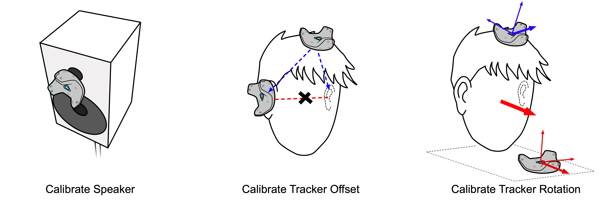

# Instructions

## Before starting the application

SteamVR needs to be running in the background with both trackers connected

  
  
  
  

# Configuration

 
 

## Configure Audio Hardware
- In the _Audio Device Status_ panel, you can select the audio input and output device, the samplerate and a custom channel assignment. The custom channel assignment might be helpful in case you want the input channels 1&2 for the measurements, but maybe input/output channel 7 for the feedback loop.
- Channel Assignment:
    - __Output Excitation__: Output for measurement speaker or left channel during headphone measurement
    - __Output Excitation 2__: Right channel for headphone measurement
    - __Output Feedback Loop__: Mirrored output of the excitation signal
    - __Input Left Ear Mic__: Input for left in-ear microphone or reference microphone during center measurement
    - __Input Right Ear Mic__: Input for right in-ear microphone.
    - __Input Feedback Loop__: Direct input for "dry" excitation signal from __Output Feedback Loop__
- Don´t change the audio settings during a measurement. If needed, you can change the channel configurations for HRIR, center and HPCF measurements, but do not change the samplerate once you started.

The image below shows audio routing examples for the three different measurement cases:

 
 

## Tracker Calibration

Two Vive Trackers are needed for the calibration. The acutal _head tracker_ and a _calibration tracker_. After the calibration, the _calibration tracker_ can be turned off.

> By default, the application assigns the _head tracker_ role to the first tracker it detects, thus the first one that was connected to SteamVR. With the `Switch Tracker Roles` button, the roles of the _head tracker_ and _calibration tracker_ can be switched. Before the calibration, the correct role assignment can be easily verified by rotating the _calibration tracker_ while holding it and looking at the displayed angle. The rotation should not affect the angle (see _Background information_ below). 

1. __Calibrate Speaker Position:__ Hold the _calibration tracker_ to the acoustical center of the speaker and press the `Calibrate Speaker` button in the GUI.

2. __Calibrate Tracker Offset:__ With the _head tracker_ attached to the head, hold the _calibration tracker_ to each ear (the bottom center of the tracker to the ear canal) and press the corresponding calibration button (`Calibrate Left / Right Ear`).

3. __Calibrate Tracker Rotation:__ Place the _calibration tracker_ on a planar surface (e.g. floor), pointing towards a desired view direction (LED on the tracker facing in opposite direction). Point the head into the same direction, so that the orientation of the _calibration tracker_ matches the orientation of the head, and press the `Calibrate Orientation` button. 

The calibration steps can be repeated in any order, if necessary. If the _head tracker_ slips during the measurement, the calibration steps 2 & 3 should be repeated. In the same way, calibration step 1 should be repeated if the loudpseaker is moved during the measurement.

 
 

> **Some additional (propably useful) information on the calibration:** 
> 
> In the uncalibrated state, the displayed angle simply represents the spherical angle between the head tracker as the origin of a spherical coordinate system and the calibration tracker as a reference point in space, as shown in the picture below:
>
> 
>
>
> While calibrating the speaker position in the first calibration step, the current position of the calibration tracker is stored. From then on, this stored position is used for the reference point and the calibration tracker only serves for calibration.  
> 
> The other two calibration steps are due to the fact that the head tracker does not represent the actual rotation center (pivot point) of the head.
>   - In order to get the position of the head center, the positions of the ears relative to the head tracker are stored. The head center is then approximated as the midpoint between the ears.
>   - The third calibration steps compensates the rotational offset of the tracker as it can be placed arbitrarily on the head.

 
 
 

### Calibration when using external tracking system (OSC)
In case you are using another tracking system which can communicate via OSC, the calibration is not done in the FreeGrid app. The external tracking system has to take care of the calibration. The external system should supply the __relative__ angle (azimuth, elevation, and radius) between the loudspeaker and the user's head, and __not__ the head orientation of the user. The bottom left panel _Vive Tracker Status_ becomes _OSC Input Status_ and will blink if OSC messages are received. 

 
  
  

# Performing Measurements
 
 

> Before starting a measurement session, the session should be given a name so that the exported file can be identified later on. For every new session, the session name must be changed, otherwise the previos session will be overwritten.

1. Perform a center measurement with a reference microphone. Place the microphone where the head center will be during the measurements and connect the microphone to the left input (Ch1) of the audio interface. 
2. Place the in-ear microphones in the ear canals and connect them to the left / right input of the audio interface (Ch1/Ch2). Set adequate levels for the output and input of the audio interface
3. Perform measurements. It is best to activate the _Auto Measurement Mode_, where a measurement is triggered when the head is still for 2 seconds. During the measurement, keep the head still for the entire time (even after the sweep is finished) until a sound for a successfull or a failed measurement signals the end of the measurement. 
    > You can pause the automatic measurement at any time to have a look at the measurements already done in the `Data List` tab. There, you can also delete erroneous measurements. The source positions of the measurements will also be shown in the virtual speaker position display.
     

    > A good starting point is to perform around 30 measurements for a full spherical coverage. This should take around 5 minutes.
3. After the inital measurements, the _Point Recommender_ algorithm can suggest additional points. The recommended point will show up in the virtual speaker position display. By pressing `Start Guidance`, a spoken word guidance tells where to move the head (always assuming you are initally looking towards the speaker), followed by a guiding "ping" tone indicating the distance to desired view direction. It is a two step procedure, first guiding the head orientation on the horizontal plance, and then guiding the head orientation to the exact spot by tilting down, up, left, or right.  

 
  

# Performing Headphone Measurements

A headphone compensation filter (HPCF) is required for accurate binaural reproduction using the acquired HRTFs. Measuring the individual HPCF directly after the individual HRTF measurements has the advantage of compensating for the in-ear microphones used and their possibly uneven placement in the ear canal.

In the application, it is possible to measure headphone impulse responses (HPIR) from which a HPCF can be estimated.

1. Set the name of the headphone
2. Connect the headphones to the stereo output of the audio interface (Ch1/Ch2).
3. Put on the headphones while keeping the in-ear microphones from the HRTF measurement in place. 
4. Perform about 10 to 15 headphone measurements. Put the headphones on and off between each measurement, resulting in slightly different positions of the headphones on the head for each measurement
5. For measuring another pair of headphones, simply click `Clear/Start New`. The HPIRs have already been saved (see section _Output & Post Processing_) .

The plots during the HPCF measurement (see picture below) show the magnitude responses of the HPIRs (left/right separated) and an estimation of the resulting HPCF filter based on [this](https://github.com/spatialaudio/hptf-compensation-filters)[2] approach. The estimated filter is not exported. 

> In our lab, we are mostly using [this](https://github.com/spatialaudio/hptf-compensation-filters) approach for generating HPCF filters, where a variable parameter _beta_ is used to regularize the inversion. Since this regularization parameter has to be set by hand, we considered it useful to include an estimation plot of the final HPCF (with variable _beta_) in the application. 

 
  
  

# Data Export
The application has no export functionality (yet). The measurement data is bundled after each single measurement as a Matlab file (.mat) and stored by default in the folder "Measurements" relative to the root folder of the Python-application (The export folder can be customized in the Configure-panel). Three different .mat files are stored: 

* **HRIRs**: Impulse repsonses and raw recorded signals for each HRIR, together with the corresponding source positions of every HRIR in [Az(0...360°), El(90...-90°), R(m)]. Furthermore, metadata such as the used sampling rate, head-dimension and sweep parameters are stored. The filename consists of `"measured_points_{session name}_{current date}.mat`.
* **Center IR** IR and raw signals for the center measurement. If the center measurement is performed multiple times, every measurement is stored (in the same .mat-file).
* **Headphone IRs**: IRs and raw signals for each HPIR measurement repetition with the regularization amount parameter _beta_ from the HPCF estimation. The HPCF estimate is not exported. The filename consists of `"headphone_ir_{hp name}_{current date}.mat`.

> Note that if a .mat file with the same name already exists, it will be overwritten!

The measurement system provides deconvolved HRIRs without further post-processing. Further post-processing and upsampling should be done seperately in Matlab, at least in the current state of work. Besides the HRIRs, additionaly the raw recorded sweeps and the feedback loop sweeps are stored (if no real feedback loop was recorded, the excitation signal is stored as the feedback loop).

 
 
