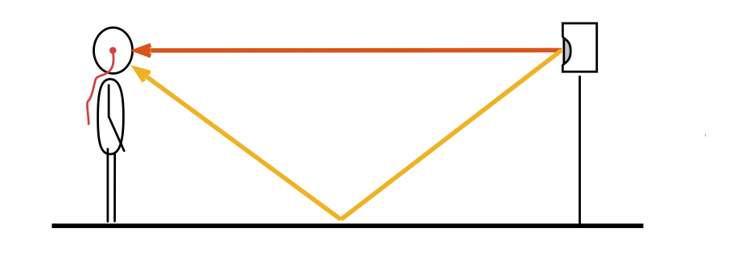

# Room Setup Guidelines

Every wall and obstacle in a room causes reflections. If the reflections arrive at the ear with a delay >4ms after the direct sound (orange line in the above picture), they can be seperated and the anechoic HRTF can be obtained from the direct sound. (For a delay of 4ms, a travelling path difference of ~1.3m is required)

Generally, a larger distance between head and closest reflective surface (ceiling, floor or wall) will **increase** the delay (good), whereas a larger distance from the head to the speaker will **decrease** the delay (not good). 

The first reflections does usually come from the floor or the ceiling and is not really inevitable. Thus, the distance to the side walls should be chosen to be larger than the distance of the head to the ceiling or floor. 

> **As a rule of thumb, with an empty space of 4x4m and a body height of 1.7m, a distance of 2m from the head to the loudspeaker should be fine.**

If these room requirements cannot be met, one could consider to damp the reflection areas with absorbers. 
